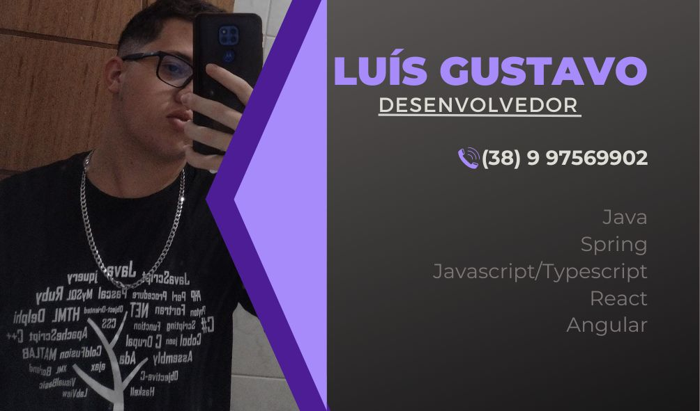

  ----
  I'm a passionate Software Developer from Brazil 🇧🇷, currently working at the Military Police of Minas Gerais. I enjoy building scalable and efficient applications, and I'm always eager to learn new technologies.

## 🚀 Skills

- **Languages**: Java, JavaScript, TypeScript
- **Frameworks**: Spring Boot, React, React Native, Next.js
- **Tools**: Docker, Firebase, Power BI
- **Design**: Figma

 <!--  -->
  

    
  

  

     
    
    
    
    
    
    
    
    
    
    
    
     
    
    
  

  
  ----
 

## 🔗 Connect with Me
  

    
    
    
    
  

    
  

  

</ul>

